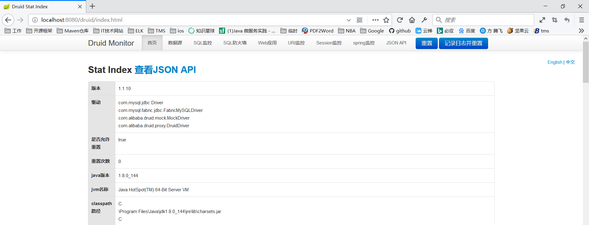

## druid笔记

[官网](https://github.com/alibaba/druid)

### spring boot集成druid

##### build.gradle 依赖配置
```java
buildscript {
    repositories {
        mavenCentral()
    }
    dependencies {
        classpath("org.springframework.boot:spring-boot-gradle-plugin:2.0.3.RELEASE")
    }
}

group 'com.jin.druid'
version '1.0-SNAPSHOT'

apply plugin: 'java'
apply plugin: 'idea'
apply plugin: 'org.springframework.boot'
apply plugin: 'io.spring.dependency-management'

sourceCompatibility = 1.8
targetCompatibility = 1.8

bootJar {
    baseName = 'druid-demo'
    version =  '1.0-SNAPSHOT'
}

repositories {
    mavenCentral()
}

dependencies {
    // 通用依赖
    compile(
            'org.springframework.boot:spring-boot-starter-web',
            'org.springframework.boot:spring-boot-starter-jdbc',
            'org.springframework.boot:spring-boot-starter-data-jpa',
            'org.slf4j:slf4j-api:1.7.25',
            'ch.qos.logback:logback-core:1.2.3',
            'ch.qos.logback:logback-classic:1.2.3',
            'com.alibaba:druid-spring-boot-starter:1.1.10',
            'mysql:mysql-connector-java:5.1.46'
    )

    // 测试依赖
    testCompile(
            "junit:junit:4.12"
    )
}
```

##### spring boot配置：application.properties
```java
spring.datasource.druid.url=jdbc:mysql://localhost:3306/druid
spring.datasource.druid.username=root
spring.datasource.druid.password=root
spring.jpa.hibernate.ddl-auto=create-drop
```

##### 统计信息
```java
@RestController
public class DruidStatController {
    @GetMapping("/druid/stat")
    public Object druidStat(){
        // DruidStatManagerFacade#getDataSourceStatDataList 该方法可以获取所有数据源的监控数据，
        // 除此之外 DruidStatManagerFacade 还提供了一些其他方法，你可以按需选择使用。
        return DruidStatManagerFacade.getInstance().getDataSourceStatDataList();
    }
}

```

##### 启动应用
```java
@SpringBootApplication(exclude = {})
public class Application {

    public static void main(String[] args) {
        SpringApplication.run(Application.class, args);
    }
}
```


##### 统计信息页面：localhost:8080/druid/stat




